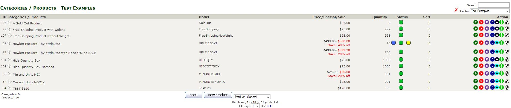
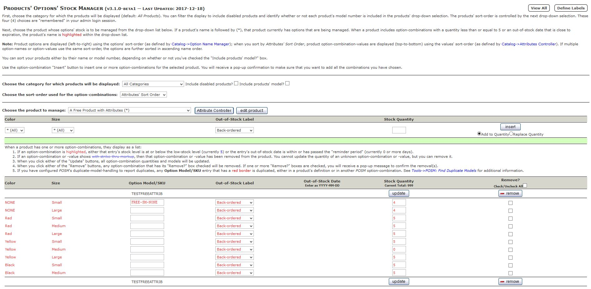
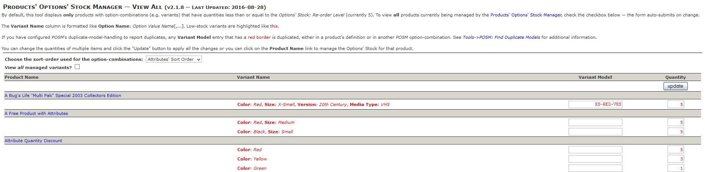
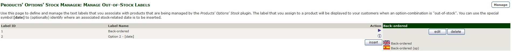
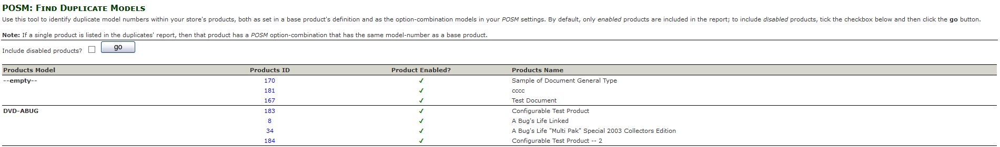
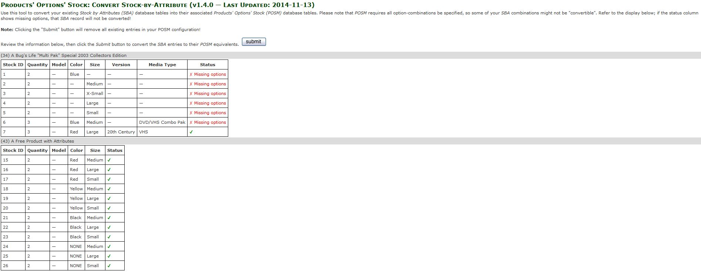

# Admin User Interface Changes

The _Products' Options' Stock Manager (POSM)_ makes changes to some of the existing admin pages "look and feel" and adds new tools as well.

- [Catalog->Categories/Products](#catalog-categories-products)
- [Catalog->Manage Options' Stock](#catalog-manage-options-stock)
- [Catalog->Options' Stock - View All](#catalog-options-stock-view-all)
- [Localization->Out-of-Stock Labels](#localization-out-of-stock-labels)
- [Tools->POSM: Find Duplicate Models](#tools-posm-find-duplicate-models)
- [Extras->Convert SBA to POSM](#extras-convert-sba-to-posm)

Starting with v2.2.0 of _POSM_, there are also [DbIo](./dbio.md) additions to aid in your store's options-stock management. 

## Catalog->Categories / Products

Once you've configured your products' options' stock information, the admin-level category listing displays the icon `/YOUR_ADMIN/images/icon_blue_on.gif` to indicate that a product has options' stock. Clicking that icon takes you to the [Catalog->Manage Options' Stock](#mos) page for that product.

**Note:** The icon might look different in your admin console, depending on what other plugins (like _Super Orders_) you might have installed.

## Catalog->Manage Options' Stock

This tool allows you to define and manage options-specific stock for the products in your store that have defined attributes. On first entry, the screen looks similar to:

There's a lot going on on this page, here's a breakdown:

1.  The **View All** button in the top-right portion of the screen will take you to the [Catalog->Options' Stock — View All](#catalog-options-stock-view-all) tool; refer to the linked section for more information.
2.  The **Define Labels** button in the top-right portion of the screen will take you to the [Localization->Out-of-Stock Labels](#localization-out-of-stock-labels) tool; refer to the linked section for more information.
3.  The upper section is a form containing four (4) fields — any change results in the form's auto-submittal. Each of these selections are _remembered_ in the logged-in admin's session.
    *   A _category_ dropdown; choose either _All categories_ or the specific category for which products are displayed.
    *   A checkbox, identifying whether or not to include disabled products in the products' drop-down.
    *   A checkbox, identifying whether or not a product's model-number is pre-pended to its name in the products' drop-down.
    *   A drop-down selection with which you choose the method by which the products' option-combinations are sorted.
4.  The products' drop-down list (an auto-submit form) on the left-hand side of the page allows you to choose the product whose options are to be managed. If the product's name is appended with **(*)**, then that product currently has options' stock definitions.  
    **Note:** Starting with v1.6.0, any product with low-stock options' definitions is highlighted in red in the product drop-down.
5.  Once you've selected a product from the dropdown list:
    1.  the "Attribute Controller" button will take you to the _Catalog->Attributes Controller_ page where you can manage the product's individual attributes.
    2.  the "edit product" button will take you to the _Catalog->Categories/Products_ page where you can edit the base product's details.
6.  Below the product drop-down list, a table is presented showing:
    1.  A column for each of the product's drop-down and/or radio-button attributes with a drop-down list showing all of the possible option values.
    2.  A drop-down list showing each of the currently-defined out-of-stock labels configured for this plugin. Use this to choose the default label to use for any inserted combinations.
    3.  A quantity input where you identify the stock quantity for each of the options.
    4.  An "insert" button; click this to insert the option-combinations you've specified. A pop-up confirmation message will appear to make sure that you want to insert the combinations.

Here's what the screen looks like when displaying the same product, but with some options-stock combinations configured:

Once the product has options' stock to manage, you can enter the _Model/SKU_ for each option-combination; starting with v2.1.4 of _POSM_, the base product's Model/SKU is displayed as a reference in the button rows. You can have different out-of-stock labels (and/or associated dates) for each combination. The **Out-of-Stock Date** input displays _only_ if the associated **Out-of-Stock Label** contains the date-insertion tag **[date]**.

Use the middle form, showing the options, out-of-stock label and stock-quantity to quickly update or change options' quantities.  For the example shown above, let's say you wanted to increase the quantity of each variant with a ***Color*** of *Red* by 3.  You'll

1. Choose `Red` from the `Color` dropdown, leaving the `Size` as `* (All)`.
2. Set the `Stock Quantity` value to 3.
3. Ensure that the `Add to Quantity` radio-button is selected and click the `Insert` button.

You'll receive a javascript confirmation of the update and, once accepted, each of the `Red` colored items' quantities will be increased by 3.

If, instead, you want to specify the quantity for those items, e.g. if all *Red* colored items should have a quantity of 3, you'd choose the `Replace Quantity` radio-button prior to clicking the `Insert` button.

## Catalog->Options' Stock View All

This tool, introduced in v1.6.0 of _POSM_, provides you with a mechanism to view (and update) your options' stock quantities and model numbers … all on a single page. The tool defaults to showing you _only_ those option-combinations with quantities less than the value you set in _Configuration->Options' Stock Manager->Options' Stock: Re-order Level_.

**Note:** The model number fields in this tool can be updated _only if_ you've set _Configuration->Options' Stock Manager->View All: Allow Model Number Updates?_ to **true**.

You access this tool from either the main admin menu or by clicking the "View All" button at the top of the _Catalog->Options' Stock Manager_ tool's display.

## Localization->Out-of-Stock Labels

This tool, accessed via _Localization->Out-of-Stock Labels_, allows you to customize the out-of-stock labels displayed to your customers when an options-stock combination's quantity has gone to zero (0). If your store has multiple languages defined, you will enter the label's text in all configured languages. When creating your out-of-stock labels, you can include the date-tag **[date]** to cause the product-option-specific date to be inserted at that point in the label.

Click the "Manage" button and you'll be redirected to the [Catalog->Manage Options Stock](#mos) page.

## Tools->POSM: Find Duplicate Models

This tool, based on the [Find Duplicate Models](https://www.zen-cart.com/downloads.php?do=file&id=1323) plugin by _swguy_, allows you to quickly find products in your store that have duplicate model numbers. Both the "standard" products' model numbers (in the `products` table) and the _POSM_ values (in the `products_options_stock` table) are searched. You access this tool via your Zen Cart admin menu's _Tools->POSM: Find Duplicate Models_.

The tool, by default, searches _only_ for products that are currently enabled. You can include disabled products as well, using the checkbox included in the tool's display. Each **Products ID** value links to either the product's _Catalog->Categories/Products_ (for non-POSM-managed products) or to _Catalog->Manage Options' Stock_ (for POSM-managed products).

## Extras->Convert SBA to POSM

If your Zen Cart is currently using the _Stock by Attributes (SBA)_ plugin, this tool (_Extras->Convert SBA to POSM_) enables you to convert your existing _SBA_ database table into its associated _POSM_ tables. Unlike _SBA_, the _Products' Options' Stock Manager_ supports only full option-combinations. As shown in the image below, some of the _SBA_ records don't include all of a product's managed options — those records won't be converted into the _POSM_ tables since they're incomplete.

