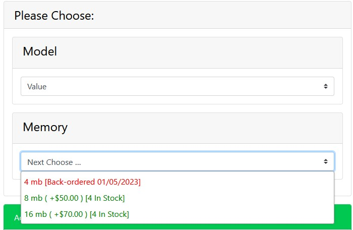
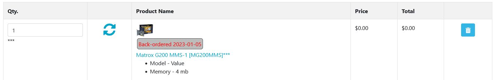
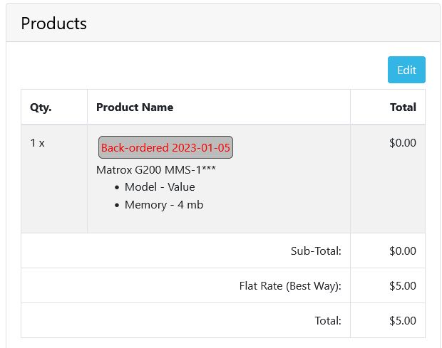
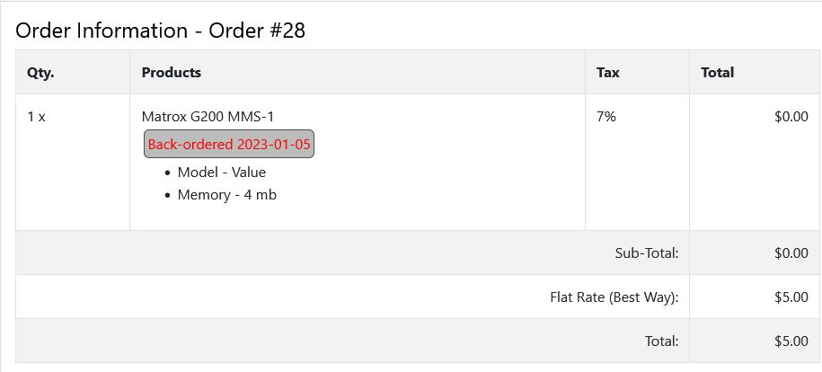

# Storefront Interface Changes

Once you've configured _POSM_ and identified which products' options are to be stock-managed, there are some interface changes on your store's customer-facing view.

## Using Dependent Attributes

If you configure your products to use [_dependent attributes_](./configuration.md), then the attribute selections are enabled (in ascending sort-order) once their predecessor value(s) have been chosen. The example below shows the display once the _Color_ attribute was chosen — the _Memory_ attribute dropdown was disabled until the _Color_ was selected.

----

----

The final attribute for the product (the _Memory_ for this example) shows the options' stock status for each selection. The example shows both in- and out-of-stock messages for the various option combinations. If you've set **Dependent Attributes: Show In-Stock Quantity in Status?** to _true_, then each option-combination's in-stock quantity displays as part of the "In Stock" status.

**Note:** Starting with _POSM_ v1.5.5, if an option-combination is not configured, those choices will not be displayed to the customer. In the example shown, if there was no option-combination for _Color: Blue_ and _Memory: 4mb_, the _Memory: 4mb_ selection is not displayed if the customer chooses _Color: Blue_.

## Displaying Out-of-Stock Messages

When a customer adds an options-stock-managed product to their cart, the option-combination's in-stock (if _Show In-Stock Status_ is set to true) or out-of-stock status message accompanies the product's display on the shopping-cart, checkout-confirmation and account-history-info pages. The stock-related message also accompanies each product's line item within the order's confirmation email.

**Notes:**

1.  The _In Stock_ label is included only if you've set the [Stock Status Display: Include In-Stock Status?](./configuration.md) value to **true**.
2.  Starting with _POSM_ v1.6.1, the labels (either in-stock or out-of-stock) are included _only if_ you've set [Stock Status Display: Show Messages?](./configuration.md) to either **Store Only** or **Both**.

----

----

 

----

